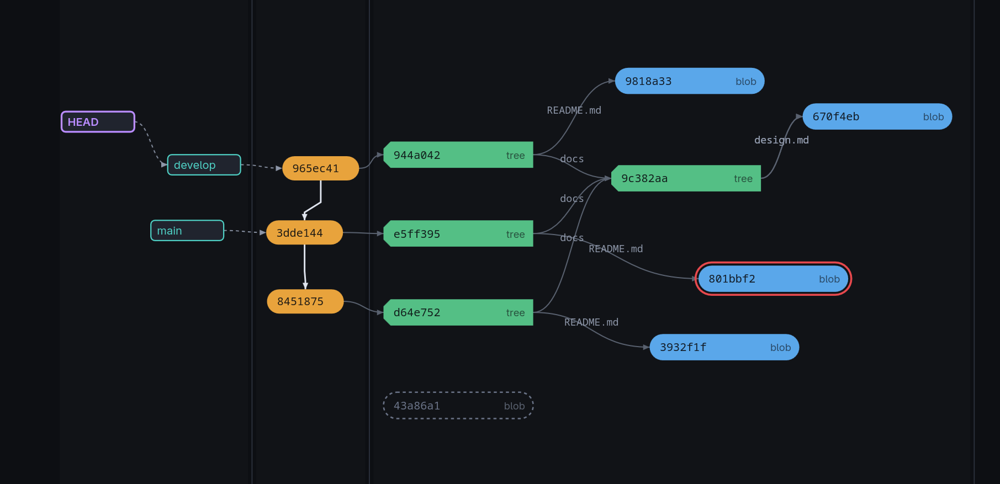
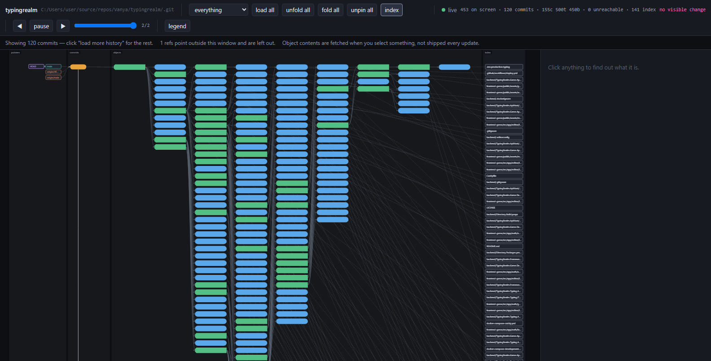

# gitva

```
git add a.txt b.txt   → two blobs appear, two index entries point at them,
                        and nothing else in the repository changes
git reset b.txt       → the index entry goes; the blob survives, now unreachable
```

gitva draws a repository's `.git` as a live object graph in your browser, to make one sentence
obvious:

> **git is just a key-value store plus a few pointers**

Put a terminal beside the browser and type. Hash an object, update the index, write a tree,
commit, reset, tag — the canvas updates on its own within a second and flashes what changed.



HEAD attached to `develop`, two index entries linked to the blobs they stage, a blob you
right-clicked wearing its mark, and one unreachable blob drawn as a ghost.

## Run

```
npm install && npm run build
npm install -g          # puts gitva on your PATH
cd some-repo
gitva
```

`gitva [repo] [--port N] [--no-open] [--serve [HOST:PORT]] [--learning] [--id NAME]` — repo defaults to `.`,
port to a free one, and the browser opens itself. Node ≥20, no runtime dependencies.

The directory need not be a repository yet: start in an empty one and gitva waits, then draws
the repository the moment you run `git init`.

`--serve` binds every interface instead of loopback, so a room can watch one repository from
their own browsers. Bare it takes `0.0.0.0:4200`; give it `HOST:PORT` to choose. There is no
authentication — anyone who reaches the port reads the whole repository.

`--id NAME` files the recording under a name of your own instead of the folder's full path, so a
repository that moved, or a second clone of one, keeps its steps. Any string will do. See below.

`--learning` starts with every commit in the window expanded, in every browser including one
that joins late, and with links from unreachable showing, so a small repository being
demonstrated needs nobody to expand anything first.

The recording is shared, and so is the view — for now. Your expansions, pins, marks, camera and
settings stay in your own browser, but the limit and the index, unreachable and
links-from-unreachable toggles are the server's single view: whoever changes one changes what
every viewer sees. The presenter drives, the room watches. *The repository is shared, the view
is yours* is the intent; today only the first half is true.

## What you see



Four columns, left to right: **pointers and tags | commits | trees and blobs | index**.

- **Objects** — blobs, trees, commits, annotated tags, submodule gitlinks; loose and packed
  alike, because to git there is no difference. Commit warm, tree green, blob blue.
- **Pointers** — branches, remotes, tags, packed refs, HEAD attached or detached, each chip
  coloured by kind. A branch is drawn as what it is: a file with a sha in it.
- **The index**, apart in its own column, each entry linked to the blob it stages. Entries no
  commit names yet are drawn violet at the top: written by `git add`, held by the index alone,
  unreachable the moment you unstage them. Conflict stages are dashed.
- **Unreachable objects** as ghosts, found by walking out from the roots. A discarded commit
  keeps its tree and its parents, so the whole abandoned state sits there waiting for `gc`.
- **What just changed**, in one accent spent on nothing else — the flash. An object that changes
  what it belongs to travels there: a blob rising into the commit that just named it, a tree
  falling in among the unreachable after a reset.
- **What is not on screen and why**, always, in the notes toolbar.

Click anything to read what that file in `.git` actually does, which command creates it, and its
raw bytes — the contents of a blob, the entries of a tree, the text of a commit object, the one
line inside a ref.

## Controls

| | |
|---|---|
| wheel | pan; hold <kbd>ctrl</kbd> to zoom |
| drag background | pan |
| double-click background | fit to width, keeping the point you clicked in view |
| click | select: read it, light the path through it, copy its sha |
| hover | light what it links to |
| right-click | mark with a red outline, to follow something as the object graph moves |
| double-click a commit | expand or collapse what it links to |
| double-click a tree | expand or collapse that subtree; collapsed it says how many entries it holds back (`tree +3`) |
| drag anything | pin it where you put it, across a reload too; shift+click unpins |
| drag a column seam | widen the left column, for room to arrange pins |
| drag the inspector's edge | widen or narrow the inspector; the width is kept |
| click a sha in the inspector | copies it |
| *reset view* | drops every pin and puts the columns back |
| click the identifier | copies what the recording is filed under, for `--id` |
| *clear* | throws the recording away, after asking; it starts again at the repository as it is now |
| <kbd>f</kbd> <kbd>←</kbd>/<kbd>[</kbd> <kbd>→</kbd>/<kbd>]</kbd> <kbd>space</kbd> <kbd>i</kbd> | fit · step back · step forward · pause · index |

The view toolbar loads the whole history, expands or collapses every commit at once, hides the
index, hides the unreachable, and shows **links from unreachable** — what a discarded object
still points at, off by default because those links cross the canvas. Nothing points at an
unreachable object; it still points at plenty. Every one of those is the same mechanism, a
change to the *view* the browser holds, which is why none of them care how big the repository is.

The recording is the server's, and it runs whether anyone is watching or not, so a browser
opening ten commands in is handed everything that happened before it arrived. Only git causes a
step — expanding and paging redraw in place and add nothing. Pause and the recording keeps going
behind you, so a demo can be **replayed instead of redone**; stepping backwards highlights the
change in reverse, which is how you show a reset twice without doing it twice. Expansions are
the exception to stepping: what you expanded stays expanded wherever you stand, and across a
reload — and so does a tree you folded shut, which is the same answer about a different shape.

The help dialog holds the legend and the keys. Beside it, settings, which survive a reload:
whether clicking centres the view, whether a new commit arrives expanded, whether pins wear a
pushpin, and whether the canvas refits the width when the repository changes. In the same
corner, **EN** and **RU** switch the language: the words are yours, like the view — nobody
else's canvas changes, and a recorded step reads in whichever language you are set to.

## The recording survives a restart

The recording is kept outside the repository, so stopping gitva and starting it again on the
same folder walks back into the same steps instead of starting the tutorial over. A restart is
not a step: if git did nothing while gitva was off, nothing is added.

It is filed under the folder's full path, one file per repository, in the directory your system
keeps a program's own state in — `~/.local/state/gitva` (or `$XDG_STATE_HOME`),
`~/Library/Application Support/gitva` on macOS, `%LOCALAPPDATA%\gitva` on Windows. The identifier
is hashed to ten characters, the way git names an object after its content, and that is the
filename. `GITVA_STATE_DIR` moves the lot somewhere else.

**The identifier is in the top-left corner, beside the repository name, and a click copies it.**
Hand it back with `--id` and the same recording comes up from anywhere: copy it before you move
the folder, or before you clone it onto another machine. `--id` takes any string, so
`--id teaching` is a name you can choose and remember instead — it is hashed the same way, and a
key you copied out of the header is taken as itself.

The view is not part of the recording. `--learning`, the index and unreachable toggles, how much
history is loaded — those are whatever the run you are in says, so you can stop gitva and start it
again in the other mode and the picture follows. What is kept is what git did.

**clear**, at the right of the recording toolbar, throws the recording away and starts it again at
the repository as it is now. It asks first, and it is everyone's recording: every viewer's browser
comes back at step one. Nothing in the repository changes — gitva does not write to it.

## Two promises

**It never writes to the repository it watches.** Not the index, not a cache, not a config
value. `src/git.ts` will only spawn git subcommands from a read-only allowlist, and sets
`GIT_OPTIONAL_LOCKS=0` so git will not take a lock to be helpful either. Where `git gc` or a
commit-graph would make things faster, gitva says so and leaves you to run it.

**Everything it knows, it learns from git's own plumbing.** No git library, no reimplemented
format. It runs the commands it is teaching, so you can read what it does and then type it
yourself.

## Big repositories

There is no big-project flag. The repository is measured once at startup and the interface
follows from that — and says so, in the notes toolbar, when something is off:

| Above the limit | What you get instead |
|---|---|
| 12,000 objects | No unreachable detection — finding one means reading every object. Everything drawn is reachable by construction, and trees load only for the commits you expand. |
| 400 staged paths | The index entries that **differ from HEAD**, plus a count for the rest. |

Listing every object is nearly free; reading every tree, which is what unreachable detection
needs, is the step that binds, and that is where both limits come from.

Sitting still costs no CPU: the render loop stops when nothing is animating, and the server's
change signal costs O(refs), not O(objects). The recording a browser is handed on connect stops
at 400 steps or 16 MB, whichever comes first.

## Building it

```
npm install
npm test                        # node:test, over real fixture repos built with real plumbing
npm start -- /path/to/repo
```

TypeScript on both sides, so the pure parts — layout, diffing, the recording, the explanations —
are written once and tested in one runner. Canvas 2D, hand-written, for the object graph.
`CLAUDE.md` is the map of the code; `INITIAL_DESIGN.md` is the why.
